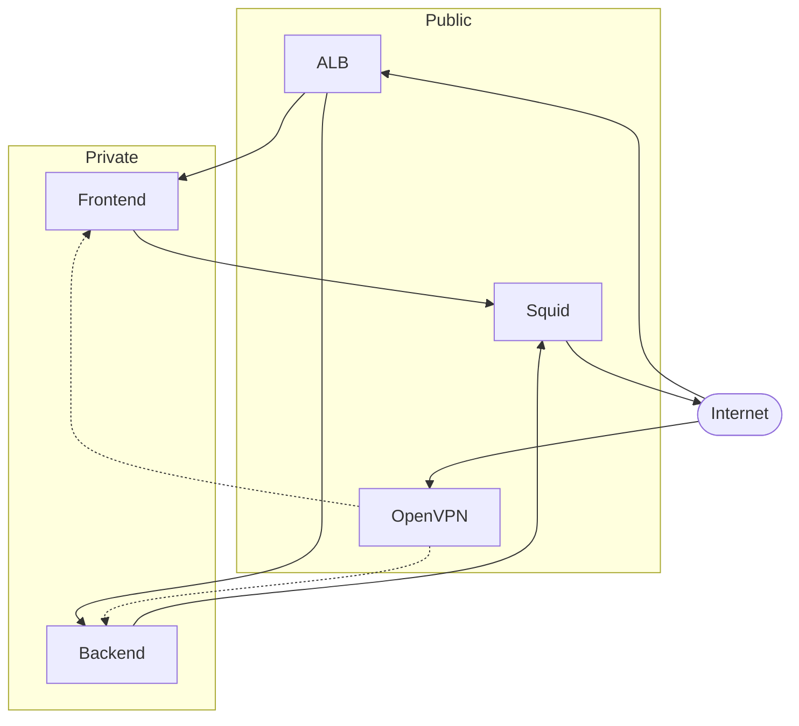

# Diagram Progression

## Step A — Two layers



## Step B — ALB path rules

```text
ALB :80
  ├─ default  → Frontend :80
  └─ /api/*   → Backend  :8000
```

## Security group names (SOP)

APP-SG · Web-SG · Backend-SG · Proxy-SG · Remote-SG · VPN-SG · Connect-SG
