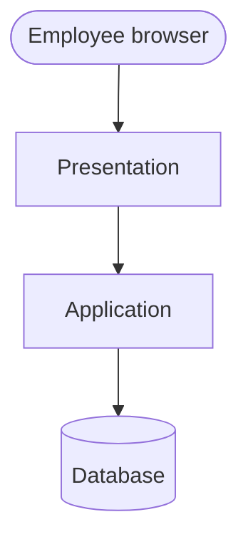
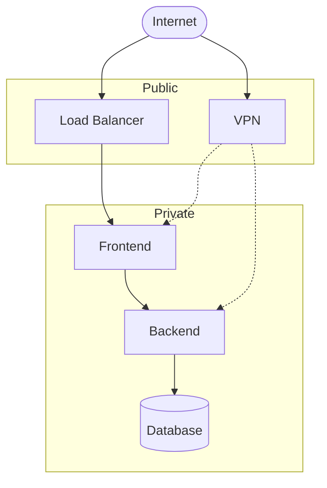
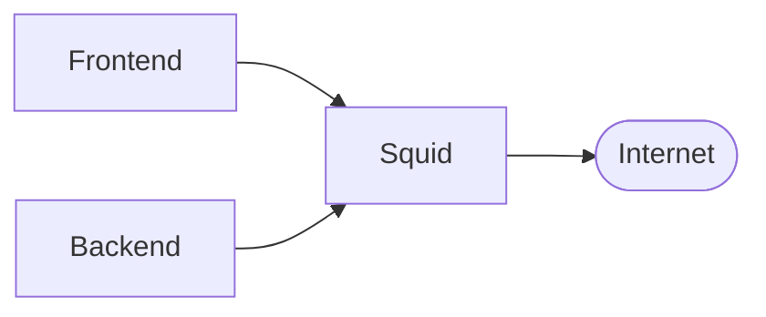

# Diagram Progression (Beginner-Friendly)

Start simple; add detail only after each layer makes sense.

## Step A — User and three tiers

## Step B — Add public vs private boxes

## Step C — Add Squid for outbound

## Reference — corrected security group names

Aligned with [../../architecture/security-group-matrix.md](../../architecture/security-group-matrix.md):

| SG | Attached to |
|----|-------------|
| ALB-SG | Load balancer |
| VPN-SG | OpenVPN server |
| PROXY-SG | Squid |
| WEB-SG | Frontend |
| BACKEND-SG | Backend |
| CONNECT-SG | Frontend & Backend (SSH from VPN) |
| DB-SG | Database |

Friend’s diagram used `APP-SG` for the load balancer; this repo uses **ALB-SG** to avoid confusion with “application tier.”
