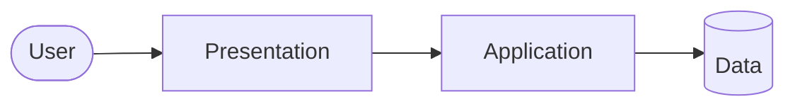

# What Is a 3-Tier Architecture?

## Objective

Define the three tiers and why teams separate them.

## The three tiers

### Presentation tier

What users see: HTML, CSS, JavaScript, or a web server that serves the UI. It should not hold secrets or direct database credentials.

### Application tier

Business rules and APIs. The frontend calls this tier over HTTP(S) inside the VPC. Validates input, enforces authorization, talks to the database.

### Data tier

Databases, caches, or file storage. Only the application tier should connect here under normal operation.

## Why businesses use it

1. **Security** — The database is not on the same host as the public web entry.
2. **Scaling** — Scale web and API independently (more frontends vs more API servers).
3. **Maintenance** — Patch or deploy one tier with less risk to the others.
4. **Compliance** — Clear boundary for audits (who can reach which tier).

## Simple diagram

## What comes next?

[public-vs-private.md](public-vs-private.md) — where each tier lives in AWS networking.
