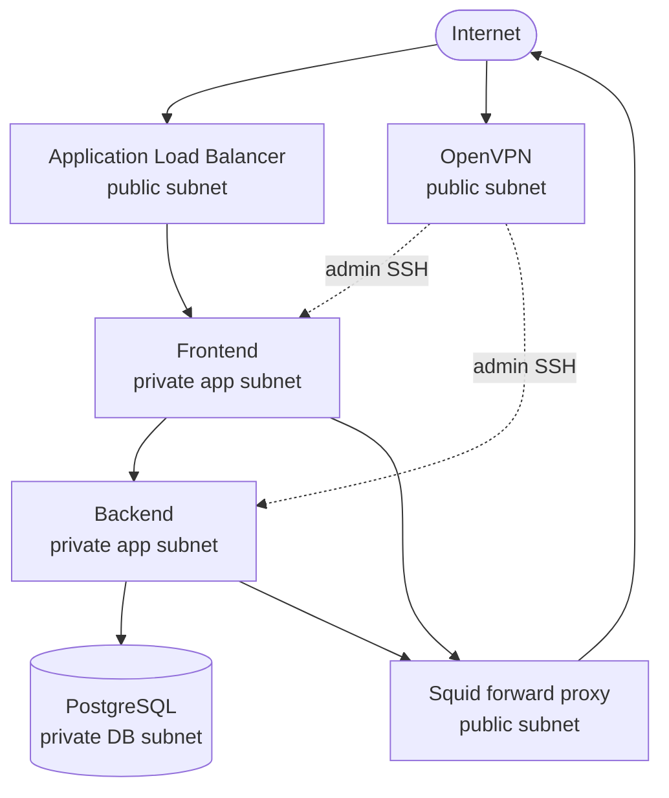

# Secure AWS 3-Tier Architecture

A **learning-first, deployable** guide that builds a real AWS three-tier application from zero: public edge services, private application servers, a private database, **OpenVPN** for admin access, and **Squid** for controlled outbound internet (no NAT Gateway in the default design).

## Project purpose

You will learn **what** each AWS piece does, **why** it exists, **in what order** to create it, and **how** to validate, operate, and tear everything down—without jumping straight to a black-box Terraform stack.

## Business use case

**NexusOps Ltd.** runs an internal operations portal for employees and branch offices:

- **Presentation tier:** web UI (nginx + static/SSR frontend)
- **Application tier:** REST API (backend on port 8000)
- **Data tier:** PostgreSQL (private; not reachable from the internet)

Requirements: public web entry via a load balancer, private API and database, VPN for administrators, segmented security groups, outbound internet only through a forward proxy, backups and monitoring as later steps.

Details: [01-understand/business-use-case.md](01-understand/business-use-case.md)

## What is 3-tier architecture?

| Tier | Role | In this project |
|------|------|-----------------|
| Presentation | User interface | Frontend EC2 (private subnet) |
| Application | Business logic / API | Backend EC2 (private subnet) |
| Data | Persistent storage | PostgreSQL (private DB subnet) |

Concepts: [01-understand/what-is-3-tier.md](01-understand/what-is-3-tier.md)

## High-level architecture



**Public layer:** resources that can have a route to an Internet Gateway (ALB, VPN, Squid).  
**Private layer:** no direct inbound internet; reach via ALB (frontend only) or VPN (admin).

## Public vs private infrastructure

| Layer | Subnets | Examples |
|-------|---------|----------|
| Public | `10.0.1.0/24` (example) | ALB, OpenVPN, Squid |
| Private app | `10.0.10.0/24` | Frontend, Backend |
| Private data | `10.0.20.0/24` | Database |

More: [01-understand/public-vs-private.md](01-understand/public-vs-private.md)

## Technology stack

| Area | Choice | Notes |
|------|--------|--------|
| Network | VPC, IGW, route tables, security groups | Manual steps first |
| Edge | Application Load Balancer | **Paid** — see [docs/cost.md](docs/cost.md) |
| Admin access | OpenVPN on EC2 (UDP 1194) | Restrict source to your IP |
| Outbound | Squid (TCP 8888) | Alternative to NAT Gateway for labs |
| Compute | Amazon Linux 2023 or Ubuntu 24.04 | t3.micro where Free Tier applies |
| Database | RDS PostgreSQL `db.t3.micro` (default doc path) | Free Tier eligible 12 months for new accounts |
| IaC | AWS CLI + docs; Terraform in a later phase | After manual flow is understood |

## Deployment roadmap

| Part | Folder | Status |
|------|--------|--------|
| 1 — Understand | [01-understand/](01-understand/) | **Available now** |
| 2 — Build infrastructure | [02-infrastructure/](02-infrastructure/) | Next phase (step-by-step) |
| 3 — Deploy application | [03-deployment/](03-deployment/) | After Part 2 |
| 4 — Test & operate | [04-operations/](04-operations/) | After Part 3 |

Correct build order (dependencies): [02-infrastructure/README.md](02-infrastructure/README.md)

## Repository structure

```
aws-3tier-architecture/
├── README.md                 ← start here
├── 01-understand/            ← concepts & diagrams
├── 02-infrastructure/        ← AWS build steps (in order)
├── 03-deployment/            ← app install & config
├── 04-operations/            ← test, troubleshoot, cleanup
├── architecture/             ← reference diagrams & SG matrix
├── iam/                      ← policies & roles (JSON)
├── scripts/                  ← validation & cleanup helpers
└── docs/                     ← cost, security, decisions
```

## Estimated cost (learning environment)

Nothing in this repo creates AWS resources by itself. When you deploy:

| Service | Free Tier / cost note |
|---------|------------------------|
| EC2 t3.micro | Often Free Tier eligible (750 h/month, 12 mo) |
| RDS db.t3.micro | Often Free Tier eligible (750 h, 20 GB) |
| **Application Load Balancer** | **~$16+/month + LCU** — not Free Tier |
| Elastic IP | Free while attached to running instance; charges if idle |
| **NAT Gateway** | **Not used** in default design (Squid instead) |
| Data transfer | Variable — monitor in Cost Explorer |

Full breakdown: [docs/cost.md](docs/cost.md)

## Security considerations

- Security groups are **deny by default**; only documented flows are opened.
- Database has **no** ingress from `0.0.0.0/0`.
- SSH from internet is **not** used on private instances; use **VPN → Connect-SG**.
- Replace `MyIP/32` placeholders with your current public IP before deploy.
- Do not commit `.pem`, `.ovpn`, or `.env` files ([.gitignore](.gitignore)).

Matrix: [architecture/security-group-matrix.md](architecture/security-group-matrix.md)

## How to use this repository

1. Read [01-understand/README.md](01-understand/README.md).
2. Skim [architecture/high-level.md](architecture/high-level.md).
3. When Part 2 is published for each step, follow **one step at a time** and run validation before continuing.
4. Use Git Bash on Windows for CLI examples:

```bash
cd "/c/Users/symoi/Desktop/New folder/aws-3tier-architecture"
aws sts get-caller-identity
```

## Defaults (you can change in Part 2)

- **Region:** set in `02-infrastructure/01-prerequisites/` (e.g. `ap-south-1` or `us-east-1`)
- **Availability zones:** 1 AZ for minimal cost first; 2 AZ documented as HA upgrade
- **Traffic path:** `Internet → ALB → Frontend → Backend → Database` (backend not exposed directly to ALB)

## Friend’s diagram vs this repo

An earlier design showed ALB → backend:8000 directly and omitted the database tier. This repository **adds the data tier**, routes API traffic **through the frontend** (or internal-only backend calls), and keeps **Squid + OpenVPN** from that design with corrected security group naming.

## License

Documentation and sample configs are provided for education. You are responsible for AWS charges in your account.
