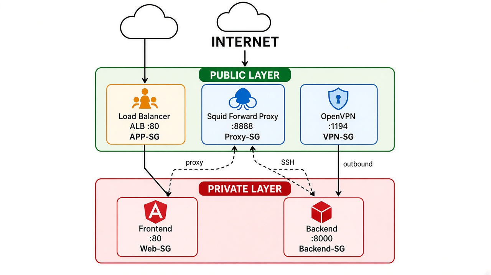

# Secure AWS 3-Tier (Squid + OpenVPN)

Friend architecture only. **No Terraform. No extra phases.**

## Architecture diagram



Also in SVG: [`architecture/diagram.svg`](architecture/diagram.svg)

```text
INTERNET
   │
   ├── ALB :80 (APP-SG) ─────► Frontend :80  (Web-SG)
   │                      └──► Backend  :8000 (Backend-SG)
   ├── OpenVPN :1194 (VPN-SG, MyIP) ──► SSH :22 (Connect-SG)
   └── Squid :8888 (Proxy-SG) ◄── Frontend + Backend outbound
```

| Who | Entry |
|-----|--------|
| Users (browser) | **ALB** |
| Admin (you) | **OpenVPN** → SSH |
| Private servers need packages | **Squid** |

## Master checklist

Tick as you go. Full detail → **[DEPLOY.md](DEPLOY.md)**

### Setup
- [ ] AWS account + region `ap-south-1`
- [ ] Note your public IP (MyIP)

### Build
- [ ] **1. VPC** — VPC, 4 subnets, IGW, public + private routes
- [ ] **2. Security groups** — APP / Web / Backend / Proxy / Remote / VPN / Connect
- [ ] **3. Key pair** — `3tier-key.pem` saved
- [ ] **4. Squid** — `10.0.1.10`, paste `userdata/squid.sh`, service running
- [ ] **5. OpenVPN** — `10.0.1.20` + EIP, `.ovpn` on PC, VPN connects
- [ ] **6. Frontend + Backend** — `10.0.11.10` / `10.0.11.20`, no public IP
- [ ] **7. ALB** — TGs + path `/api/*` (**paid**)

### Test
- [ ] `http://<ALB-DNS>` shows Frontend + Backend JSON
- [ ] `/api/health` → `{"status":"ok"}`
- [ ] Target groups **Healthy**
- [ ] VPN → SSH to private IPs works
- [ ] Squid path works on private hosts

### Cleanup / reset
- [ ] Delete ALB → TGs → 4 EC2 → EIP → SGs → subnets → VPC  
  (step-by-step boxes in [DEPLOY.md](DEPLOY.md))

## Full steps with checklists

→ **[DEPLOY.md](DEPLOY.md)**

Boot scripts: [`userdata/`](userdata/)

## Cost

ALB is **paid**. Use Cleanup checklist when done.
