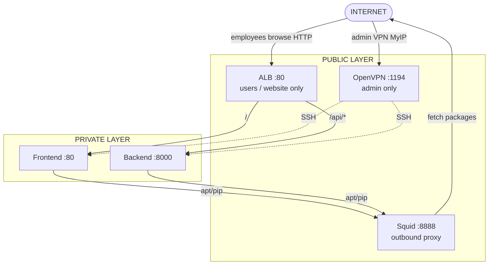

# Secure AWS 3-Tier Architecture

A **hand-deployed** AWS lab (AWS Console clicks — **not Terraform**): public ALB + Squid + OpenVPN in front of private Frontend and Backend.

---

## 1. Introduction diagram (start here)

**Internet is at the top.** Traffic flows **down** into AWS.

### Who uses what? (important)

| Person | How they enter | Uses ALB? |
|--------|----------------|-----------|
| **Employee / user** (browser) | Internet → **ALB :80** → website + API | **Yes** — ALB is for them |
| **Admin** (you) | Internet → **OpenVPN** → SSH to private servers | **No** — admin does **not** use ALB |

**ALB is not an “admin tool”.**  
It is the **public front door for the web app** (many users, HTTP).  
Admin work (SSH, fix servers) goes through **OpenVPN only**.

```text
                         INTERNET  (top)
                              │
          ┌───────────────────┼───────────────────┐
          │                   │                   │
          ▼                   ▼                   ▼
   ┌─────────────┐    ┌──────────────┐    ┌──────────────┐
   │ EMPLOYEES   │    │ ADMIN (you)  │    │ (outbound)   │
   │ browser     │    │ OpenVPN only │    │ Squid later  │
   └──────┬──────┘    └──────┬───────┘    └──────────────┘
          │                  │
          ▼                  ▼
   ┌──────────────────────────────────────────────┐
   │              PUBLIC LAYER                    │
   │  ALB :80          OpenVPN :1194   Squid:8888 │
   │  (users only)     (admin only)    (servers'  │
   │                                   way OUT)   │
   └──────────┬─────────────────┬─────────────────┘
              │                 │
              ▼                 ▼
   ┌──────────────────┐   SSH to private IPs
   │  PRIVATE LAYER   │◄──────────────────
   │  Frontend :80    │◄── ALB default (/)
   │  Backend  :8000  │◄── ALB /api/*
   └──────────────────┘
```



**Why ALB still makes sense in a small lab?**  
Even with one Frontend + one Backend, ALB gives you: one public URL, health checks, and path `/api/*` → Backend — without putting public IPs on private servers. Later you can add more Frontend instances behind the same ALB (real “load balancing”). For admin SSH you never need ALB.

| Fixed IPs (use these values everywhere) | |
|---|---|
| Squid | `10.0.1.10` |
| OpenVPN | `10.0.1.20` (+ Elastic IP) |
| Frontend | `10.0.11.10` |
| Backend | `10.0.11.20` |
| Region | `ap-south-1` · Ubuntu 24.04 · `t3.micro` |

---

## 2. What is Squid and why is it here?

**Squid is a forward proxy** — a middleman for **outbound** internet from private servers.

| Without Squid (typical AWS) | This lab |
|-----------------------------|----------|
| Private EC2 uses a **NAT Gateway** (~expensive) to reach the internet | Private EC2 has **no** route to the internet |
| | They send `http_proxy=http://10.0.1.10:8888` to **Squid** |
| | Squid (in a public subnet) fetches packages for them |

**Role in one sentence:**  
Frontend/Backend cannot talk to the internet directly; Squid is the **only allowed door out** (for `apt`, `pip`, `curl` to ubuntu.com, etc.).

**Squid is NOT:**

- A load balancer (that is the ALB)
- A VPN (that is OpenVPN)
- Something you run on your laptop every day

**Where Squid code lives / runs:**

| Item | Location | Who runs it | When |
|------|----------|-------------|------|
| Install + config | [`userdata/squid.sh`](userdata/squid.sh) | **AWS EC2 at first boot** | You paste it into Console → Launch instance → User data |
| Console steps | [`02-infrastructure/04-squid/`](02-infrastructure/04-squid/) | **You** click in browser | Phase 5 of deploy |

You do **not** run `squid.sh` in Git Bash on your PC. EC2 runs it once at boot.

---

## 3. Two kinds of “code” in this repo (this is the confusion)

| Kind | Folders | You do this | It runs where |
|------|---------|-------------|----------------|
| **A. Instructions** | `01-understand/`, `02-infrastructure/`, `03-deployment/`, `04-operations/` | Read + click AWS Console | Your browser |
| **B. User data (boot scripts)** | `userdata/*.sh` | **Copy-paste** into EC2 “User data” box | **Inside the EC2 instance** at first boot |
| **C. Optional CLI scripts** | `scripts/*.sh` | Ignore for hand deploy | Only if you choose AWS CLI later |
| **D. IAM JSON** | `iam/policies/*.json` | Paste into IAM → Create policy | AWS IAM (once) |

There is **no Terraform**. Hand deploy = **A + B + D**. Skip **C**.

---

## 4. End-to-end sequence (one path — follow this)

```text
SETUP → NETWORK → SECURITY → SQUID → VPN → APPS → ALB → CONNECT → TEST → CLEANUP
```

| Step | What you do | Guide (instructions) | Code to paste / use | Execute how |
|------|-------------|----------------------|---------------------|-------------|
| 0 | Learn concepts (optional) | [`01-understand/`](01-understand/) | — | Read only |
| 1 | IAM user + policy | [`02-infrastructure/01-iam/`](02-infrastructure/01-iam/) | [`iam/policies/3tier-deploy-policy.json`](iam/policies/3tier-deploy-policy.json) | Console → IAM |
| 2 | VPC / subnets / IGW / routes | [`02-infrastructure/02-vpc/`](02-infrastructure/02-vpc/) | — | Console → VPC |
| 3 | Security groups | [`02-infrastructure/03-security-groups/`](02-infrastructure/03-security-groups/) | — | Console → EC2 → SG |
| 4 | Key pair `3tier-key` | (same as Squid guide) | Download `.pem` to your PC | Console → Key pairs |
| 5 | Launch **Squid** | [`02-infrastructure/04-squid/`](02-infrastructure/04-squid/) | Paste [`userdata/squid.sh`](userdata/squid.sh) | Console → Launch EC2 |
| 6 | Launch **OpenVPN** + EIP | [`02-infrastructure/05-openvpn/`](02-infrastructure/05-openvpn/) | Paste [`userdata/openvpn.sh`](userdata/openvpn.sh) | Console → Launch EC2 |
| 7 | Launch **Frontend + Backend** | [`02-infrastructure/06-app-servers/`](02-infrastructure/06-app-servers/) | Paste edited [`userdata/frontend.sh`](userdata/frontend.sh) + [`backend.sh`](userdata/backend.sh) | Console → Launch EC2 (private) |
| 8 | Create **ALB** | [`02-infrastructure/07-load-balancer/`](02-infrastructure/07-load-balancer/) | — | Console → EC2 → Load Balancers (**costs money**) |
| 9 | Connect VPN + SSH | [`03-deployment/vpn-client.md`](03-deployment/vpn-client.md) | `.ovpn` from VPN server; `ssh` with `.pem` | OpenVPN app on **your PC** |
| 10 | Test | [`04-operations/testing/`](04-operations/testing/) | Browser + `curl` / `ssh` | Your PC |
| 11 | **Reset / cleanup** | [`04-operations/cleanup/`](04-operations/cleanup/) | Delete ALB → EC2 → EIP → SG → VPC | Console (all delete steps in that one folder) |

**Reset / cleanup lives in one place:** [`04-operations/cleanup/README.md`](04-operations/cleanup/README.md) — do not hunt through other folders for teardown.

---

## 5. What each component does

| Component | Job | Lives in subnet | Code / config |
|-----------|-----|-----------------|---------------|
| **ALB** | Public entry: `/` → Frontend, `/api/*` → Backend | Public | Console only (no script required) |
| **Squid** | Outbound proxy for private servers (port 8888) | Public `10.0.1.10` | `userdata/squid.sh` |
| **OpenVPN** | Secure tunnel so you can SSH to private IPs | Public `10.0.1.20` | `userdata/openvpn.sh` |
| **Frontend** | Nginx web page | Private `10.0.11.10` | `userdata/frontend.sh` |
| **Backend** | Python API on port 8000 | Private `10.0.11.20` | `userdata/backend.sh` |
| **Security groups** | Firewall rules between components | VPC | Console steps in phase 3 |
| **VPC / routes** | Network; private RT has **no** internet route | — | Console steps in phase 2 |

---

## 6. Why code is separate from “deployment guides”

| Separation | Why |
|------------|-----|
| `02-infrastructure/.../README.md` | **How to click** in AWS Console (human steps) |
| `userdata/*.sh` | **What the server installs** at boot (must be plain bash for EC2 User data) |
| `iam/policies/*.json` | **What IAM allows** (must be JSON for IAM console) |
| `scripts/*.sh` | Optional automation — **same result**, different method; kept aside so Console path stays clear |
| `04-operations/cleanup/` | **All delete/reset steps together** so you are not redirected during teardown |

When a guide says “paste userdata”, open the matching file under `userdata/`, copy all, paste into Console. That is the link between folders.

**Frontend/Backend paste tip:** before paste, replace `__SQUID_IP__` → `10.0.1.10` and `__PROXY_PORT__` → `8888`.

---

## 7. CLI vs Console (quick rule)

| Action | Tool |
|--------|------|
| Create VPC, SG, EC2, ALB | **AWS Console** (primary) |
| Paste User data | Console Launch wizard |
| Create `.ovpn` after VPN is up | SSH once: `sudo make-client my-pc <EIP>` |
| Connect VPN / browse ALB / SSH private hosts | **Your PC** (OpenVPN app, browser, `ssh`) |
| Optional full automation | `scripts/` (skip if deploying by hand) |
| Terraform | **None** |

---

## 8. How sections connect

```text
01-understand     →  why (read)
02-infrastructure →  build AWS resources (Console + userdata paste)
03-deployment     →  connect from your laptop (VPN client)
04-operations     →  test / fix / DELETE everything
userdata/         →  boot code referenced by phases 5–7
iam/              →  policy JSON referenced by phase 1
scripts/          →  optional; not part of hand path
```

---

## 9. Go-live checklist

- [ ] `http://<ALB_DNS>` shows Frontend + Backend JSON  
- [ ] `http://<ALB_DNS>/api/health` → `{"status":"ok"}`  
- [ ] Both ALB targets healthy  
- [ ] Frontend/Backend have **no** public IP  
- [ ] From private host: internet via Squid works; direct (`--noproxy`) times out  
- [ ] OpenVPN connected → SSH to `10.0.11.10` / `10.0.11.20` works  

**Cost:** ALB and idle Elastic IPs bill money → clean up via [`04-operations/cleanup/`](04-operations/cleanup/) when done. Details: [`docs/cost.md`](docs/cost.md).

---

## Next click

**Start deploying:** [`02-infrastructure/01-iam/README.md`](02-infrastructure/01-iam/README.md)  
**Need teardown only:** [`04-operations/cleanup/README.md`](04-operations/cleanup/README.md)
